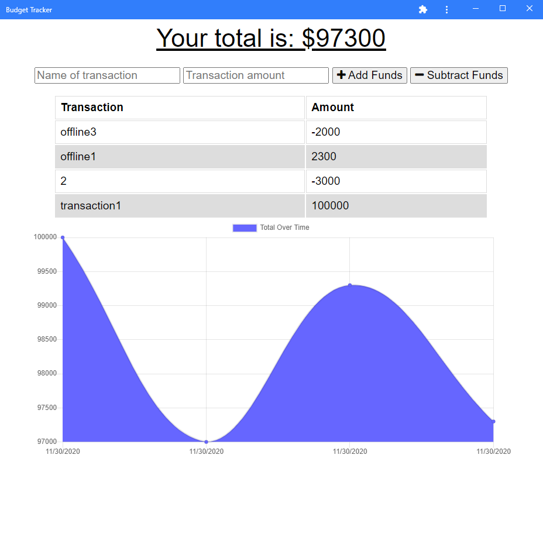

# Budget Tracker
 
  
 
  

A full-stack expense tracker app built on NodeJS using ExpressJS, MongoDB, and Mongoose.  

See your cumulative balance on a pretty graph!  

Meets all requirements of a PWA (Progressive Web App) and includes downloadable and offline functionality!  

---

## Table of Contents

* [Installation](#Installation)  
* [Contribution](#Contribution)  
* [User Story](#User-Story)  
* [Link to Deployed Application](#Link-to-Deployed-Application)  
* [Example](#Example)  
* [Contents](#Contents)  
* [Team](#Author)  
* [License](#License)  
* [Credits](#Credits)  
  
 ---
 
 
## Installation

Feel free to [clone the repo](https://github.com/abraspin/budget-tracker) and run locally by using the terminal/bash command `node server` or `npm run start`

## Contribution

Please contact me if you find an issue or have a suggestion for future development!
 
## User Story

>AS AN avid traveller  
>I WANT to be able to track my withdrawals and deposits with or without a data/internet connection  
>SO THAT my account balance is accurate when I am traveling  

---

## Link to Deployed Application

Just visit  to begin!  

Add or subtract expenses at will. Even if you lose internet connection to the app, transactions made while offline will automatically update once connection is restored!  

---

## Example

---

## Author
[Abraham Spindel](https://github.com/abraspin)

---

## License

---

## Credits
* NodeJS Project [MIT license](https://raw.githubusercontent.com/nodejs/node/master/LICENSE)   
* Express Morgan [MIT license](https://github.com/expressjs/morgan/blob/master/LICENSE)
* ChartJS [MIT license](https://github.com/chartjs/Chart.js/blob/master/LICENSE.md)
* MongoDB [SSPL](https://www.mongodb.com/licensing/server-side-public-license)
* MongoDB Mongoose [MIT license](https://github.com/Automattic/mongoose/blob/master/LICENSE.md)
* ExpressJS [MIT license](https://github.com/expressjs/express/blob/HEAD/LICENSE)   
* Node compression [MIT license](https://github.com/expressjs/compression/blob/HEAD/LICENSE)   
* Node lite-server [MIT license](https://github.com/johnpapa/lite-server/blob/HEAD/LICENSE)   
* Node Package Manager (npm) [Artistic License 2.0](https://www.npmjs.com/policies/npm-license)  

